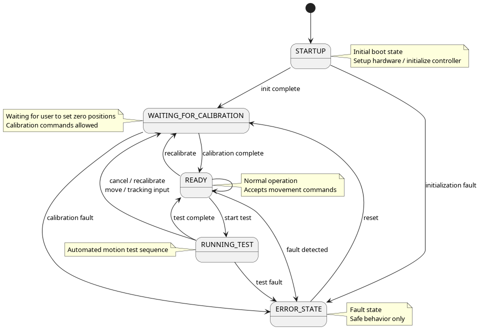
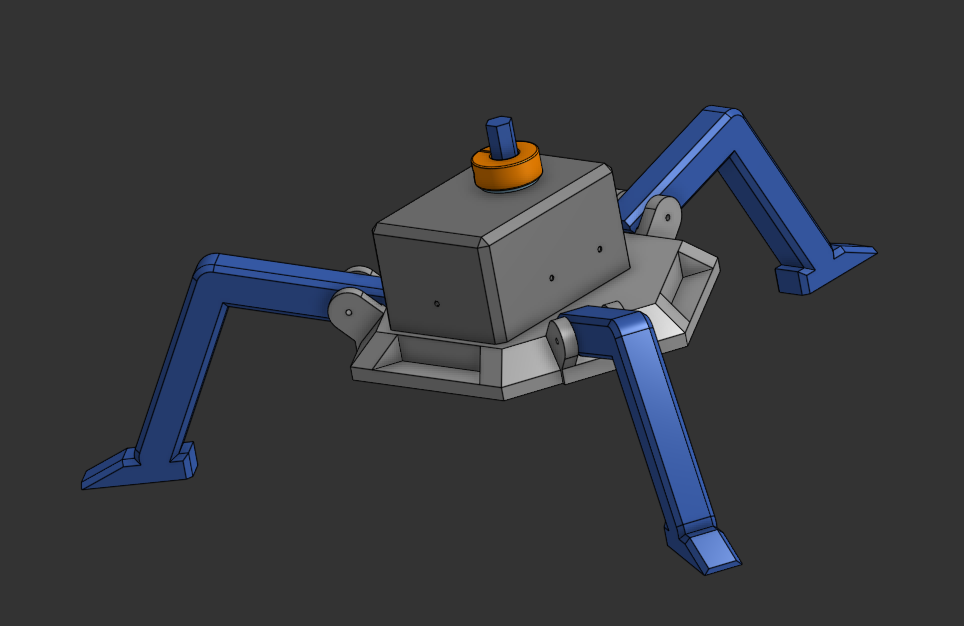
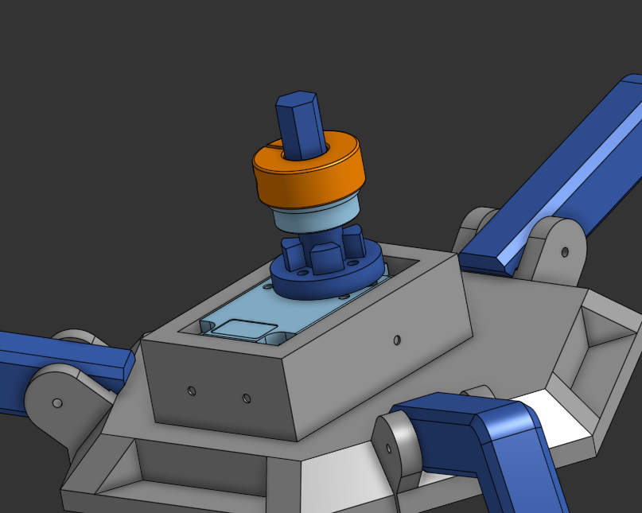
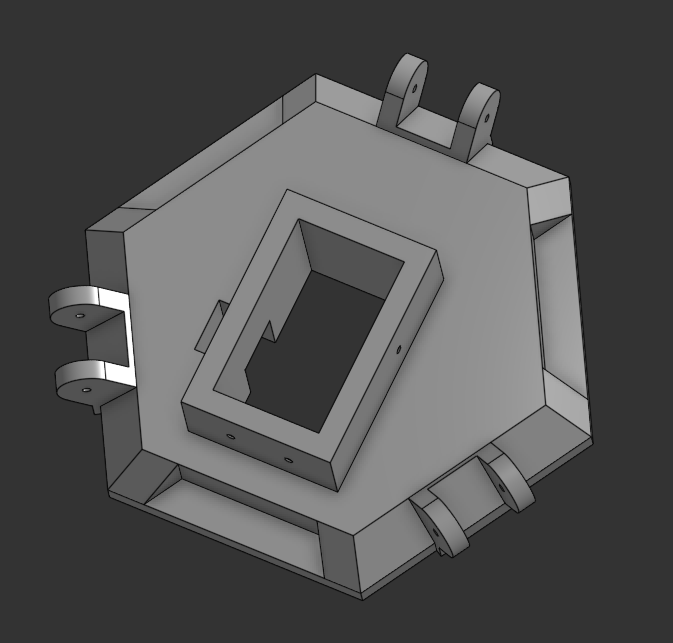
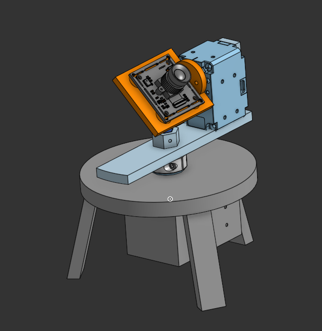
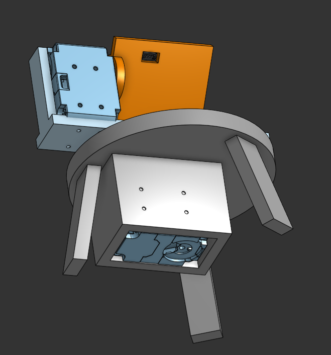
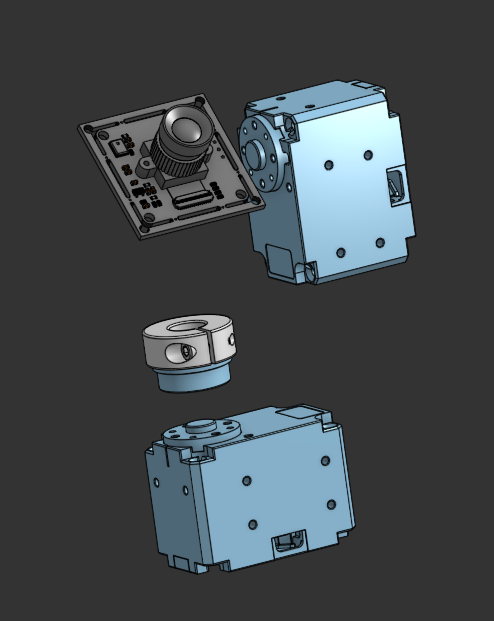
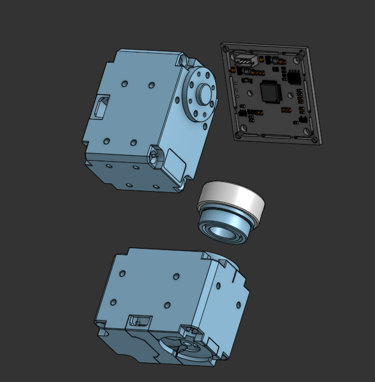
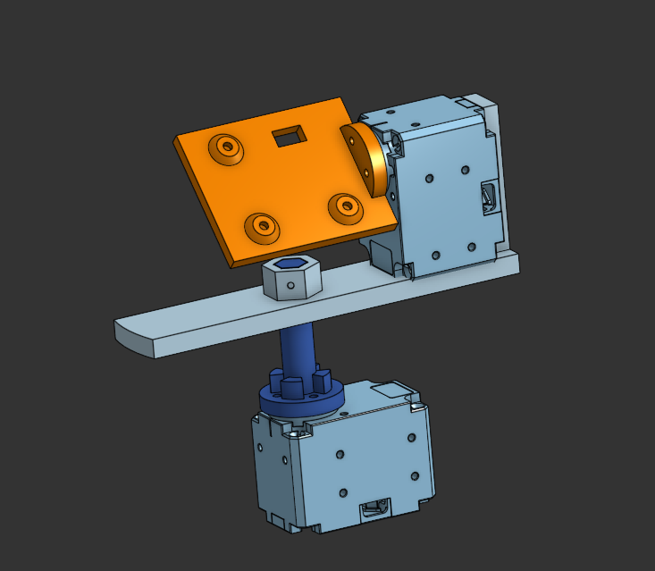

# Autonomous Computer Vision Tracking Gimbal

A hardware-software integrated pan-tilt gimbal designed to replace imprecise manual tracking with autonomous target identification. The system is capable of maintaining a target in a centered frame across a 180-degree field of view with zero human intervention. 

## Technical Stack
* **Design & Manufacturing:** Onshape (CAD), Ultimaker S5 (3D Printing), PLA plastic.
* **Vision & Compute:** NVIDIA Jetson Xavier AGX, Arducam 2MP Global Shutter Camera. 
* **Software Pipeline:** MediaPipe (Inference), OpenCV (Image Processing, HUD Overlay).
* **Actuation & Microcontroller:** OpenRB-150, DYNAMIXEL XL430-W250-T Servos.

## System Architecture & State Machine
The firmware utilizes a deterministic finite state machine to manage system behavior and safety:

* **STARTUP:** Initial boot sequence handling hardware setup and controller initialization.
* **WAITING_FOR_CALIBRATION:** Awaits user commands to establish the zero/home positions for the pan and tilt axes.
* **READY:** Normal operation mode where the system accepts real-time movement and tracking commands.
* **RUNNING_TEST:** Executes an automated motion test sequence to validate mechanics before entering live tracking.
* **ERROR_STATE:** A safe-behavior fallback triggered by any faults (initialization, calibration, tracking, or test errors). A manual reset is required to return to the calibration state.

## Hardware & Mechanics
The physical assembly features a 3-legged base with integrated housing for the Dynamixel actuators to ensure stability. The mechanical design prioritizes structural rigidity and compactness to minimize the moment of inertia within the footprint of the servos. Motor mounts use reinforced geometry to eliminate flex during high-speed stops. 

## Control Methodology
The system always computes the correct absolute position directly from computer vision. It utilizes a closed-loop approach where the pixel distance from the target centroid to the frame center is calculated in real-time. 

To prevent unnecessary jitter and mechanical "hunting" during minor oscillations, a central deadband (buffer zone) is implemented. The gimbal remains stationary if the centroid is within this defined region. Once the target exits the buffer, the error is processed to update the servo position via the microcontroller. Internal torque sensing from the Dynamixel servos is used to compensate for the unbalanced center of mass and ensure smooth motion.

## Project Gallery

#### Live Test Demo

#### Assembled Hardware
###### Front Isometric

###### Top Down

###### Bottom Isometric

###### Folded Configuration

###### Front Isometric Live

###### Rear Isometric Live

###### Bottom View Live

###### NVIDIA Jetson & OpenRB-150

## CAD Drawings Final Prototype
#### The final iteration utilizes a 3-legged base with integrated housing for the Dynamixel actuators for stability and aesthetics
###### Isometric View without yaw axis portion

###### Internal Axis: Housed Actuator Assembly

###### Main Chassis Plate: Leg Attachment Geometry

## CAD Drawings Original Prototype
#### Initial proof-of-concept iteration focusing on component spacing, axis alignment, and basic structural stability
###### Prototype Assembly: Initial Prototype Layout

###### Bottom View: Prototype Motor Mounting and Internal Housing

###### Exploded View: All Reference Geometry Stack (Front)

###### Exploded View: All Reference Geometry Stack (Rear)

###### Axial Assembly: Component Alignment

