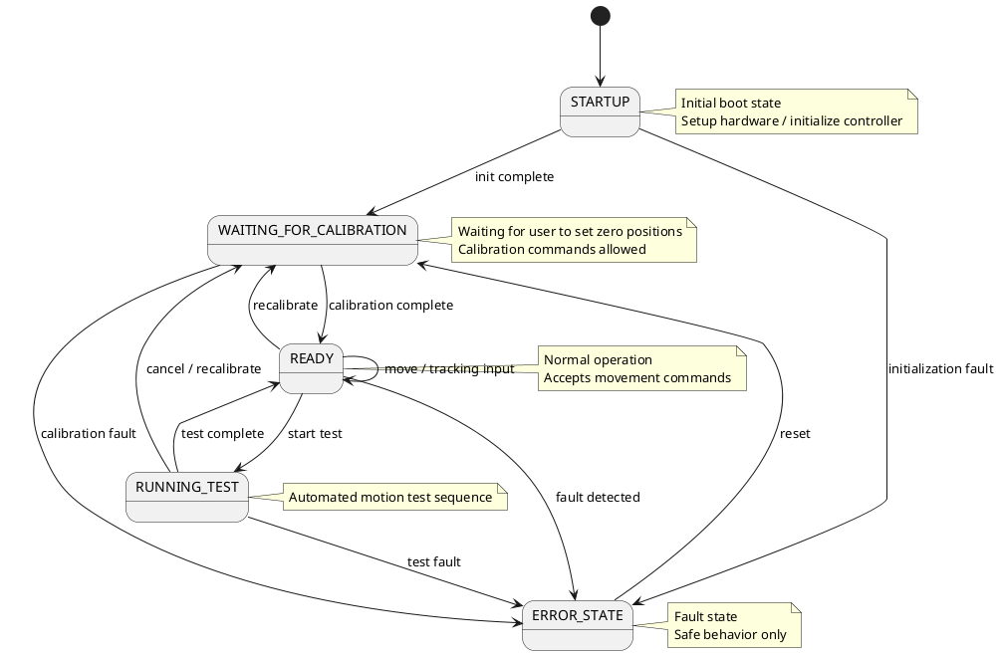

```plantuml
@startuml
[*] --> STARTUP

state STARTUP
state WAITING_FOR_CALIBRATION
state READY
state RUNNING_TEST
state ERROR_STATE

note right of STARTUP
  Initial boot state
  Setup hardware / initialize controller
end note

note right of WAITING_FOR_CALIBRATION
  Waiting for user to set zero positions
  Calibration commands allowed
end note

note right of READY
  Normal operation
  Accepts movement commands
end note

note right of RUNNING_TEST
  Automated motion test sequence
end note

note right of ERROR_STATE
  Fault state
  Safe behavior only
end note

STARTUP --> WAITING_FOR_CALIBRATION : init complete
STARTUP --> ERROR_STATE : initialization fault

WAITING_FOR_CALIBRATION --> READY : calibration complete
WAITING_FOR_CALIBRATION --> ERROR_STATE : calibration fault

READY --> READY : move / tracking input
READY --> RUNNING_TEST : start test
READY --> WAITING_FOR_CALIBRATION : recalibrate
READY --> ERROR_STATE : fault detected

RUNNING_TEST --> READY : test complete
RUNNING_TEST --> ERROR_STATE : test fault
RUNNING_TEST --> WAITING_FOR_CALIBRATION : cancel / recalibrate

ERROR_STATE --> WAITING_FOR_CALIBRATION : reset
@enduml
```